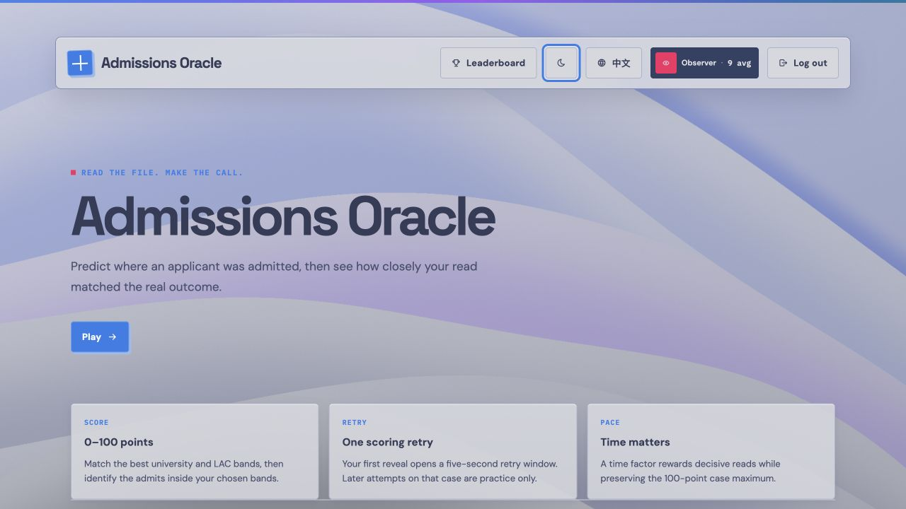
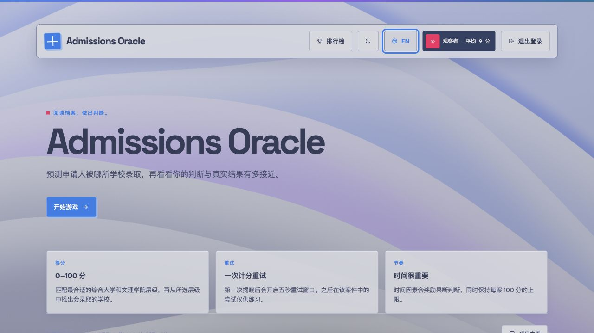
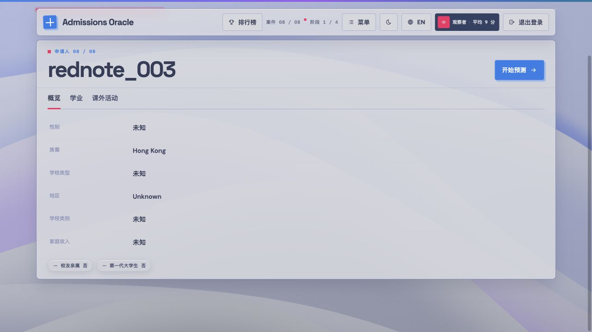
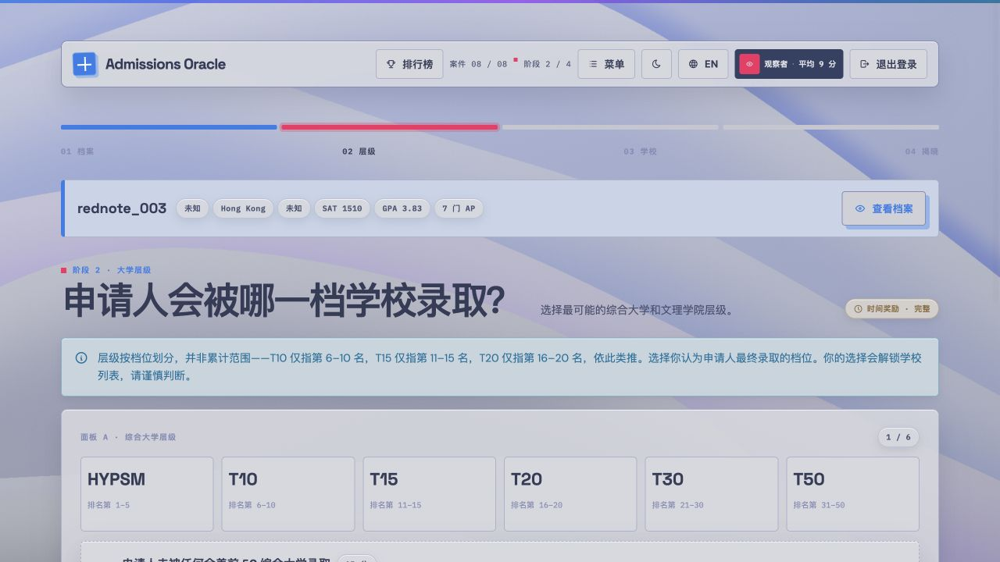
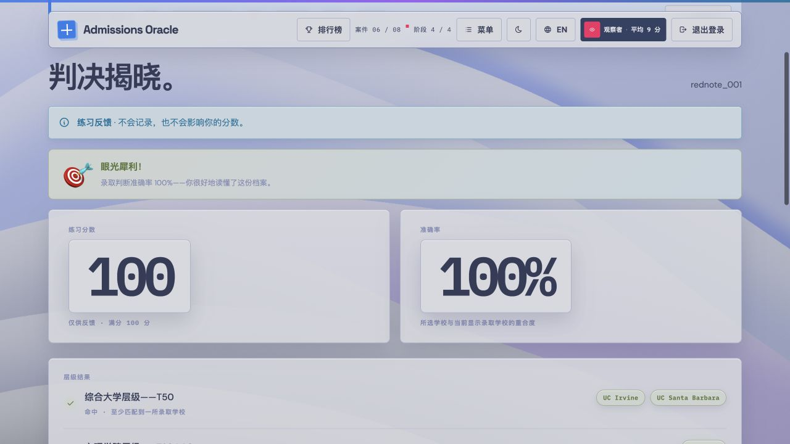
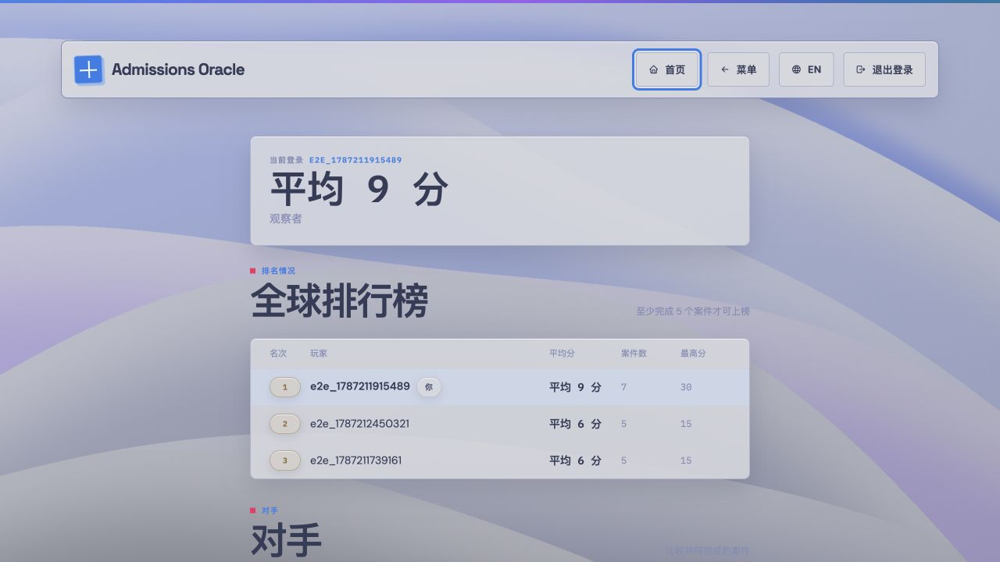

# Admissions Oracle

A React-based college admissions guessing game. Players study a deliberately small case library, predict admissions outcomes across university and liberal-arts-college tiers, and compare skill-based results. Reddit import remains a disabled-by-default maintainer tool, not a player feature.

## Visual tour

The same game flow is available in English and Simplified Chinese, with a persistent Tokyo Night/Day theme and no runtime translation dependency.

| English Home | 简体中文主页 |
|---|---|
|  |  |

| Applicant profile | Tier prediction |
|---|---|
|  |  |

| Practice reveal | Leaderboard |
|---|---|
|  |  |

## License

MIT — see [LICENSE](LICENSE). Contributing rules: [CONTRIBUTING.md](CONTRIBUTING.md). Vulnerability reporting: [SECURITY.md](SECURITY.md).

This project is co-owned and co-developed by ChromedomeV12 (repo owner) and Mason W ([MJanW](https://github.com/MJanW)).

## Architecture

1. **Frontend (`public/`)** — React SPA. The development page keeps the simple source-script workflow, while `npm run build` transpiles JSX ahead of time and bundles React, ReactDOM, Three.js, and Tabler icons into first-party `dist/` assets for production. Signed-in users land on Home, then enter four game phases (Profile → Tier → Schools → Reveal), persistent Tokyo Night/Day themes, a global leaderboard, and rival head-to-head comparisons.
2. **Backend (`server.js`)** — Express. Serves `public/` in development and the built `dist/` tree in production, with JSON APIs under `/api/*` (unknown `/api` paths return 404 JSON, not the SPA). JWT sessions (`jsonwebtoken`), bcrypt password hashing (`bcryptjs`). Production startup fails closed without a strong `JWT_SECRET`.

3. **Storage (hybrid)**:
   - `data/profiles.jsonl` — static game content. Read-only to the server and reloaded for profile-list requests. Replace the file to update content.
   - `data/game.db` — SQLite (`better-sqlite3`, WAL) for users, best per-profile scores, permanent practice locks, rivals, consent receipts, OAuth state hashes, and privately queued Reddit submissions.

## Theme & visual system
- **Tokyo Night / Tokyo Day**: use the moon/sun button in the signed-in topbar. The choice persists as `ao_theme` in local storage. Exact palette anchors and derived web surfaces live in `public/styles-v2.css`.
- **Palette integrity**: canvas, text, comments and semantic blue/magenta/cyan/green/yellow/red tokens use the supplied Tokyo values exactly; intermediate surfaces and borders are derived with `color-mix()` rather than unrelated hex colors.
- **Matte glass**: semantic cards/topbars keep strong Tokyo surface identity with restrained 12px blur, higher surface opacity, token borders, and theme-aware shadows.
- **Sculpted wallpaper**: a full-viewport Three.js shader builds six overlapping organic fold boundaries with Tokyo-derived layer colors, crest highlights, and deep valley shadows—closer to macOS abstract cloth/paper relief than line art. Motion is a very slow ≥45s breathing drift plus ≤64px scroll and ≤8px pointer parallax (30fps cap, paused when hidden). Reduced-motion draws one static frame. A broad six-layer filled-SVG fallback preserves the same folded look if Three/WebGL initialization fails; the geometric grid and topographic contours are removed.
- `styles-v2.css` is authoritative. The production build uses a system font stack and removes Tailwind Play CDN, Google Fonts, browser Babel, and every boot-critical third-party asset request.

## Language support

The interface supports English (`en`) and Simplified Chinese (`zh-CN`) without a runtime translation service. A first visit starts in English. The globe control switches languages in place, persists the exact locale in local storage as `ao_lang`, and keeps the document `<html lang>` attribute synchronized across reloads.

This first localization phase translates app-owned UI copy, accessible names, dates, and the approved structured profile enums. Stable product data remains unchanged in both modes: applicant IDs, usernames, school names, tier codes, scores, API fields, and URLs. Free-form imported profile prose—including course/activity descriptions, awards, and teaching points—is intentionally preserved rather than machine-translated. Translation resources and locale helpers live in `public/i18n.js`.

### API surface

| Method | Path | Auth | Purpose |
|---|---|---|---|
| POST | `/api/register` | — | `{username, password}` → `{token, username, scores}`. Username `^[a-zA-Z0-9_]{3,20}$`, password 8–72 chars. |
| POST | `/api/login` | — | Same shape as register. |
| GET | `/api/me` | Bearer | Session check + best per-profile scores. |
| GET | `/api/profiles` | — | All playable profiles with outcomes stripped. |
| GET | `/api/profiles/:id` | Bearer + finalized lock | One full profile; outcomes are unavailable until the server records a finalized attempt or permanent Practice lock. |
| POST | `/api/attempts/start` | Bearer | Start one server-timed prediction attempt for a real profile. |
| POST | `/api/attempts/:id/reveal` | Bearer | Submit prediction inputs; returns aggregate-only first results or atomically finalizes the retry result. |
| POST | `/api/attempts/:id/retry` | Bearer | Reserve the single five-second retry before its deadline. |
| POST | `/api/attempts/:id/finalize` | Bearer | Finalize the stored first result after timeout. |
| POST | `/api/attempts/:id/abandon` | Bearer | Safely abandon pre-reveal attempts or finalize pending scored attempts when leaving/reloading. |
| GET | `/api/locks` | Bearer | List the current user's permanent Practice locks. |
| GET | `/api/leaderboard` | — | `[{username, games, avg, best}]` — global rounded average over distinct server-finalized cases; only players with `>= 5` cases qualify. |
| POST / GET | `/api/rivals` | Bearer | Add a known username as a rival / list rivals. |
| DELETE | `/api/rivals/:username` | Bearer | Remove a rival. |
| GET | `/api/duel/:username` | Bearer | Head-to-head scores on cases completed by both players. |
| GET | `/api/stats` | — | Aggregate play stats. |
| GET | `/healthz` | — | Process liveness probe; returns `{"status":"ok"}`. |
| GET | `/readyz` | — | SQLite/profile readiness probe; returns 503 until usable. |
| GET | `/api/submissions/config` | Bearer | Reports `enabled`, OAuth availability, fallback availability, and consent version. |
| GET / POST / DELETE | `/api/submissions...` | Bearer + `X-Maintainer-Key` + `SUBMISSIONS_ENABLED=true` | Maintainer-only consent/ownership workflow. Disabled deployments return `503 {"error":"Submission tools are disabled"}`; enabled deployments reject missing/wrong keys with 403. |
| GET | `/api/submissions/reddit/callback` | OAuth state + `SUBMISSIONS_ENABLED=true` | Complete temporary Reddit ownership verification; the unguessable state binds the flow to the enabled maintainer request. |

## Scoring

Every case scores **0–100 — never negative** — split across three skills:

- **School selection (70):** rounded Jaccard overlap `70 × |selected ∩ admitted| / |selected ∪ admitted|` over only the schools shown for the chosen bands. Wrong picks enlarge the union; missed admits reduce the intersection.
- **University tier (15):** distance credit — correct band 15, off-by-one 9, off-by-two 5, else 0. The explicit “Applicant was not admitted to any T50 University” claim earns 15 only when there is no configured top-50 university admit, otherwise 0.
- **LAC tier (15):** the same distance ladder. The explicit “Applicant was not admitted to any T20 LAC” claim earns 15 only when correct, otherwise 0.

Tier credit follows the best actual admitted band, but near misses retain partial credit. Example: if a profile reached a stronger band than predicted but was also admitted in the predicted lower band, distance scoring still awards 9 or 5 rather than treating the prediction as wholly wrong.

The first reveal shows only server-computed aggregate score, accuracy, and time plus a **5-second Retry case** action. It deliberately hides tier, school, and final-decision details and does not publish a score. Retrying reserves the second attempt; its exact result replaces the first even when lower. Letting the server deadline expire finalizes the first attempt. Either path atomically writes the score and permanent Practice lock before the client can fetch full answers. Reload, tab close, logout, and navigation abandon or recover active attempts server-side, so they cannot create extra scoring rounds. Practice runs show full answers immediately with an explicit “not recorded” label, omit time/rank/contribution claims, never offer a retry, and never write scores.

The leaderboard ranks by **global average per-case score** over distinct finalized cases (minimum 5 to qualify), not by total or season. Rivals compare only shared completed cases.

## Local setup

```bash
npm install
cp .env.example .env   # then edit: set JWT_SECRET (generation one-liner inside)
npm run dev            # http://localhost:3005
```

`.env` keys: `PORT`, `JWT_SECRET`, `SUBMISSIONS_ENABLED` (default `false`), and `MAINTAINER_API_KEY` (required, nonempty, for maintainer submission routes). Maintainers who deliberately enable submission tooling may also set `REDDIT_CLIENT_ID`/`REDDIT_CLIENT_SECRET`/`REDDIT_REDIRECT_URI`, `REDDIT_USER_AGENT`, and `OPENROUTER_API_KEY` (optional LLM structuring during `npm run approve`). Create a Reddit **web app** and register the redirect URI exactly (production must use HTTPS). Without the `REDDIT_*` credentials, the tool attempts edit-code fallback, but Reddit may block the public `.json` confirmation request with HTTP 403; fallback is best-effort, not a guaranteed substitute for approved API access.

Build the self-hosted production assets with:

```bash
npm run build
node -e "console.log(require('node:crypto').randomBytes(48).toString('base64url'))"
NODE_ENV=production JWT_SECRET="paste-the-generated-value-here" npm start
```

`dist/` is generated and ignored by Git. The production server adds a restrictive Content Security Policy and long-lived caching only for hashed vendor assets.

## Testing

```bash
npm test
```

Runs the Node unit suite (shared server/browser scoring, deployment configuration/build gates, health/readiness behavior, both no-admit claims, bilingual resource/runtime contracts, invalid predictions, Reddit URL/OAuth/ownership helpers, post sanitization, and design-contrast checks), followed by the complete development E2E and a separate production-mode browser smoke test. The production smoke test verifies the built page boots under CSP, serves hashed assets with immutable caching, and makes no third-party HTTP requests. The game E2E writes to the real `data/game.db` with unique usernames per run.

Acceptance checks: [AGENT_CHECKLIST.md](AGENT_CHECKLIST.md) — the agent-run self-check workflow (boot, API, auth, all four phases, navigation/persistence, console-error watch, screenshots, and the `npm test` gate).

## Maintainer-only consent import pipeline

Player-facing submission UI has been removed. All submission routes except the safe config read are disabled unless the server starts with `SUBMISSIONS_ENABLED=true`; enabled routes additionally require the nonempty `MAINTAINER_API_KEY` supplied as `X-Maintainer-Key`. These controls are intended for a maintainer-operated environment, not normal game deployment.

1. An authenticated maintainer with the API key submits one Reddit post URL from its author together with the displayed, versioned consent.
2. **OAuth mode** (Reddit app credentials configured): the server records the consent version and a hashed, 15-minute OAuth state, then redirects to Reddit with only `identity` and `read` scopes (`duration=temporary`). The unguessable state is the callback authorization; after redirect, the server compares `/api/v1/me` with the post's API-reported author.
3. **Fallback mode** (no credentials): the server issues a one-time edit code (`ORACLE-XXXXXX`, 30-minute TTL). The post author edits their post to include it; confirmation re-fetches via Reddit's public JSON endpoint and verifies the code.
4. On success the server stores a minimized post snapshot in `reddit_submissions` with status `verified_pending_review`. It never stores access tokens or exposes the Reddit username in the game API.
5. `npm run export-verified` moves verified records into `data/queue.jsonl` as consent drafts; a human editor runs `npm run approve` to publish. There is intentionally no automatic publish path.
6. A pending record can be withdrawn; its stored title, body, account identifier, and ownership fingerprint are purged.

Bulk subreddit scraping and arbitrary `--url` imports remain disabled. See [Consent and Reddit import architecture](docs/CONSENT_IMPORT.md).

## Known limitations / roadmap

- **Authoritative attempt state** — scores are computed from server-held profiles and prediction inputs; the first reveal is pending until retry/timeout, and the final score+Practice lock are written atomically. Existing scores are reset once by `SCORING_VERSION=3` because the persistence semantics changed.
- **Editorial dashboard** — consent import is a maintainer-only API/CLI workflow. Ownership verification plus export (`npm run export-verified`) is implemented, but approval remains CLI-only (`npm run approve`).
- **Reddit app review** — Reddit may require review or approval before API use. The edit-code fallback avoids OAuth but depends on public JSON availability.
- **Reddit public JSON blocking** — verified on 2026-08-19: `www.reddit.com` and `old.reddit.com` returned HTTP 403 from browser and server-side requests. Do not bypass this by exporting personal cookies; use approved API access, a dedicated throwaway test profile for one-off diagnostics, or a reviewed manual workflow.
- **Development source page** — the local no-build page still uses development CDNs for convenience. Production deployments must run `npm run build`; the build and production smoke gate reject boot-critical third-party dependencies.
- **Legacy seed consent** — the eight current seed cases predate the new proof flow. Replace them with consented or synthetic cases before a broad public launch.
- `public/uploads/` still holds early prototype artifacts (`sample.jsonl`, original scraper prompt) — candidates for pruning.

## Deployment notes

- Start with the [private single-instance runbook](docs/PRIVATE_DEPLOYMENT_RUNBOOK.md): a non-root container, persistent SQLite volume, loopback-only binding, and SSH-tunnel access.
- Review [deployment options](docs/DEPLOYMENT_OPTIONS.md) before choosing a provider. Free ephemeral services do not preserve this app's SQLite state.
- Keep `SUBMISSIONS_ENABLED=false`. The private package is not a public launch; public exposure still requires persistent auth rate limits, automated off-host backups, privacy/deletion contacts, and consented or synthetic cases.
