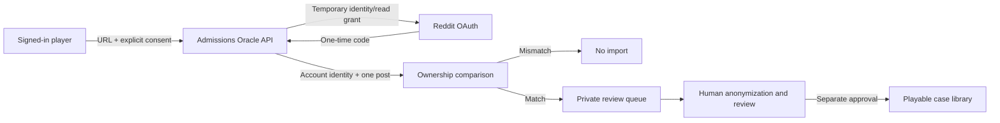

# Consent and Reddit import architecture

## Product rule

Admissions Oracle does not crawl subreddits or publish a case from a pasted URL. A new Reddit-derived case must move through four gates:

1. An authenticated app user submits one Reddit post URL and accepts a versioned consent statement.
2. Reddit OAuth confirms the Reddit account using temporary `identity read` access.
3. The server fetches that one post from Reddit's OAuth API and compares its `author` with `/api/v1/me`.
4. A matched post enters a private `verified_pending_review` queue. Human review is required before any separate publication workflow.

There is no automatic path from URL submission to `data/profiles.jsonl`.

## Data flow

## Proof model

- A Reddit web-app authorization code is exchanged server-side.
- OAuth `state` is 32 random bytes. Only its SHA-256 hash is stored, and it expires after 15 minutes.
- The access token is temporary and held only in memory while calling `/api/v1/me` and `/api/info?id=t3_<post_id>`.
- Ownership passes only when the authenticated Reddit username exactly matches the post author, case-insensitively.
- The stored proof is a keyed username fingerprint plus Reddit's account ID. The username itself is not returned by application APIs.
- Deleted, removed, inaccessible, or account-mismatched posts fail closed.

This proves control of the Reddit account at verification time. It does not prove that every statement in the post is true or that third-party material inside the post is licensed.

## Stored data

For every attempt:

- local app user ID
- normalized Reddit post ID and canonical URL
- consent version and timestamp
- submission status and timestamps
- hashed OAuth state while verification is pending

Only after ownership succeeds:

- subreddit, title, self-post body, creation time, and permalink
- Reddit account ID and a keyed ownership fingerprint
- verification timestamp

Never stored:

- Reddit password
- Reddit access or refresh token
- cookies
- comments, votes, inbox data, subscriptions, or unrelated posts

Withdrawing a pending submission clears the title, body, subreddit, post metadata, Reddit account ID, ownership fingerprint, and pending OAuth state. The minimum audit record remains: submission ID, app user ID, canonical URL, consent version, timestamps, and `withdrawn` status.

## Statuses

| Status | Meaning |
|---|---|
| `awaiting_reddit_verification` | Consent recorded; OAuth must finish within 15 minutes. |
| `verified_pending_review` | Account matched the post author; private editorial review is required. |
| `verification_expired` | The OAuth state expired before completion. |
| `verification_cancelled` | The user denied or cancelled Reddit authorization. |
| `verification_failed` | Ownership mismatch, missing post, or Reddit API failure. |
| `withdrawn` | User withdrew; stored post content was purged. |

Future editorial tooling may add `pending_editorial_review`, `rejected`, and `published`, but publishing must remain a distinct authorized action.

## API and security controls

- All submission list, create, and withdrawal routes require the existing app bearer token.
- Create attempts are limited to five per app user per hour in the current process.
- URLs accept HTTPS links from known Reddit hosts only and discard query strings and tracking parameters.
- Duplicate Reddit post IDs are rejected.
- OAuth requests use the least-privilege `identity read` scopes and `duration=temporary`.
- Callback state is single-use because its stored hash is cleared on every terminal result.
- Errors shown to users do not expose Reddit tokens, client secrets, or raw API responses.
- Production must use HTTPS, a strong `JWT_SECRET`, a persistent SQLite volume, backups, retention rules, and structured security logs that exclude post bodies and secrets.

## Launch requirements

Before enabling public submissions:

- register a Reddit **web app** and set the callback URI exactly;
- confirm whether Reddit requires app review for the intended distribution and volume;
- publish a privacy policy describing Reddit data use, retention, withdrawal, and contact methods;
- complete a legal review of copyright, publicity, minors' data, and applicable privacy law;
- replace or re-consent legacy seed cases that predate this ownership flow;
- define the editorial anonymization checklist and appeals/removal process;
- add persistent rate limiting and an abuse-reporting channel;
- verify current Reddit Developer Terms and Data API Terms again immediately before launch.

The implementation reduces risk but is not legal advice and does not by itself establish permission for third-party content quoted inside a user's post.
