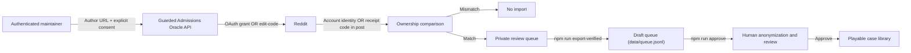

# Consent and Reddit import architecture

## Product rule

Admissions Oracle does not expose Reddit submission to players, crawl subreddits, or publish a case from a pasted URL. The import API is a disabled-by-default maintainer tool: normal game deployments keep `SUBMISSIONS_ENABLED=false`, and guarded routes return HTTP 503. When a maintainer deliberately enables it, a Reddit-derived case must pass four gates:

1. An authenticated maintainer records one Reddit post URL from its author and the author's versioned consent.
2. Ownership is proven. With Reddit OAuth configured (preferred), the author completes a temporary `identity read` grant and the server compares `/api/v1/me` with the post author. Otherwise, the author places an issued `ORACLE-XXXXXX` receipt code in the post body.
3. The server fetches that one post and confirms ownership by exact author match or receipt-code presence.
4. A match enters a private `verified_pending_review` queue. Human anonymization/editorial review and separate export/approval commands are required before publication.

There is no automatic path from a URL to `data/profiles.jsonl`, and no player-facing submission center.

## Data flow

## Proof model

There are two proof paths, selected by whether Reddit OAuth credentials are configured after the maintainer has explicitly enabled submission tooling.

### OAuth path (preferred)

- A Reddit web-app authorization code is exchanged server-side.
- OAuth `state` is 32 random bytes. Only its SHA-256 hash is stored, and it expires after 15 minutes.
- The access token is temporary and held only in memory while calling `/api/v1/me` and `/api/info?id=t3_<post_id>`.
- Ownership passes only when the authenticated Reddit username exactly matches the post author, case-insensitively.
- The stored proof is a keyed username fingerprint plus Reddit's account ID. The username itself is not returned by application APIs.
- Deleted, removed, inaccessible, or account-mismatched posts fail closed.

### Edit-code fallback path

Used automatically when `REDDIT_CLIENT_ID`, `REDDIT_CLIENT_SECRET`, and `REDDIT_REDIRECT_URI` are not all configured. No Reddit OAuth is involved.

- On submission the server generates a receipt code `ORACLE-` followed by six characters from `crypto.randomBytes(6)` rendered base64url and reduced to `[A-Z0-9]` — i.e. `/^ORACLE-[A-Z0-9]{6}$/`.
- The code is stored on the row with a 30-minute TTL (`FALLBACK_CODE_TTL_MS`) and the submission status becomes `awaiting_fallback_code`. No Reddit network call happens at issue time.
- The submitter edits the code into their Reddit post body, then hits the confirm endpoint. The server fetches the post from Reddit's public JSON and checks whether the code appears in the body (`verifyFallbackEditCode`).
- A match moves the row to `verified_pending_review` and stores the minimized post snapshot, exactly like the OAuth path. A miss keeps the row in `awaiting_fallback_code` with `failure_reason = 'edit_code_not_found'` — the submitter can retry in place after editing the post.
- Expiry moves the row to `verification_expired`; the user must re-submit to get a fresh code.

#### Observed public JSON limitation

Testing on 2026-08-19 found that top-level browser navigation and server-side `curl` requests to both `https://www.reddit.com/*.json` and `https://old.reddit.com/*.json` returned HTTP 403 HTML ("blocked by network security"), including requests with a browser-like or descriptive application User-Agent. Therefore edit-code confirmation is **best-effort**: issuing the local code works offline, but the final confirmation cannot succeed when Reddit blocks the public JSON fetch. Treat 403 as an operational outage, not an ownership mismatch.

Do not bypass this by copying a developer's personal Chrome cookies into WSL. Chrome on Windows protects cookies with App-Bound Encryption, and Chrome 136+ ignores remote-debugging switches for the default data directory specifically to prevent cookie extraction. A cookie database copied into Linux is not a portable login session.

If a one-off authenticated diagnostic is approved, use a **dedicated non-default Windows Chrome profile and throwaway Reddit test account**, log in manually, launch Chrome with an explicit non-default `--user-data-dir` and remote-debugging port, then connect Puppeteer over CDP and disconnect after the single test. Never automate the developer's daily profile, persist exported cookies, or mass-scrape. Prefer approved Reddit API access or a manual user-supplied post-text workflow for production. See [Chrome's remote-debugging security change](https://developer.chrome.com/blog/remote-debugging-port) and [Reddit Data API Terms](https://redditinc.com/policies/data-api-terms).

This proves control of the Reddit account at verification time. It does not prove that every statement in the post is true or that third-party material inside the post is licensed.

### Consent-phishing tradeoff

Neither proof path fully resists a determined social engineer. In the OAuth path an attacker could forward the `authorizeUrl` to the post's real author and social-engineer that author into clicking through Reddit's own consent screen — the victim's own OAuth grant then "legitimately" verifies a post the attacker chose. In the fallback path the attacker only needs the author to paste a short `ORACLE-` code. Both attacks require the genuine author to perform an action on Reddit's own surface. This residual risk is accepted because every verified submission is gated by human review before publication: a reviewer who notices a mismatched submission can reject it, and the post content itself is what ultimately gets anonymized and published, not the verification metadata.

## Stored data

For every attempt:

- local app user ID
- normalized Reddit post ID and canonical URL
- consent version and timestamp
- submission status and timestamps
- hashed OAuth state while OAuth verification is pending; OR the fallback receipt code and its expiry timestamp while an edit-code verification is pending

Only after ownership succeeds:

- subreddit, title, self-post body, creation time, and permalink
- Reddit account ID and a keyed ownership fingerprint
- verification timestamp

Never stored:

- Reddit password
- Reddit access or refresh token
- cookies
- comments, votes, inbox data, subscriptions, or unrelated posts

Withdrawing a pending submission clears the title, body, subreddit, post metadata, Reddit account ID, ownership fingerprint, and pending OAuth state. The minimum audit record remains: submission ID, app user ID, canonical URL, consent version, timestamps, and `withdrawn` status.

## Statuses

| Status | Meaning |
|---|---|
| `awaiting_reddit_verification` | Consent recorded; OAuth must finish within 15 minutes. |
| `verified_pending_review` | Account matched the post author; private editorial review is required. |
| `verification_expired` | The OAuth state expired before completion. |
| `verification_cancelled` | The user denied or cancelled Reddit authorization. |
| `verification_failed` | Ownership mismatch, missing post, or Reddit API failure. |
| `withdrawn` | User withdrew; stored post content was purged. |
| `awaiting_fallback_code` | Edit-code fallback active: a receipt code was issued and the submitter must edit it into the post, then confirm. |
| `exported_pending_approval` | Verified submission was exported to `data/queue.jsonl` as a draft by `npm run export-verified`; awaiting `npm run approve`. |

The export CLI (`npm run export-verified`) moves `verified_pending_review` rows to `exported_pending_approval` as it appends them to `data/queue.jsonl`; `npm run approve` then structures and approves those drafts into `data/profiles.jsonl`. Future editorial tooling may add `rejected` and `published`, but publishing must remain a distinct authorized action.

## API and security controls

- `GET /api/submissions/config` requires the existing bearer token and reports `enabled`. List/create/confirm/callback/delete routes additionally require `SUBMISSIONS_ENABLED=true`; otherwise they return `503 {"error":"Submission tools are disabled"}`.
- The game UI contains no submission navigation or form. The API/CLI workflow is for maintainers only.
- Create attempts are limited to five per app user per hour in the current process.
- URLs accept HTTPS links from known Reddit hosts only and discard query strings and tracking parameters.
- Duplicate Reddit post IDs are rejected unless the existing row belongs to the same authenticated maintainer and remains retryable, in which case the proof state is refreshed.
- OAuth requests use least-privilege `identity read` scopes and `duration=temporary`; callback state is single-use.
- Errors do not expose Reddit tokens, client secrets, or raw API responses.
- Production requires HTTPS, a strong `JWT_SECRET`, persistent SQLite storage, backups, retention rules, and security logs excluding post bodies/secrets. Keep the player-facing deployment's submission flag disabled.

## Editorial export and approval pipeline

Once a submission reaches `verified_pending_review`, it is not yet a playable case. Two CLI steps move it there:

1. **Export verified drafts** — `npm run export-verified`. Reads `data/game.db` for rows with `status='verified_pending_review'` (pass `--all` to also re-export rows already in `exported_pending_approval`), appends each to `data/queue.jsonl` as a draft entry `{ draft: true, draftKind: 'reddit-consent', consent: { … }, source: { subreddit, scrape_date } }`, then updates the row to `exported_pending_approval`. Supports `--dry-run` (no writes) and `--db <path>` to target a copy. This is the only writer that connects verified consent submissions to the game.
2. **Approve drafts** — `npm run approve`. Structured via OpenRouter when `OPENROUTER_API_KEY` is set; otherwise approved drafts are written as defensive `GameRecord` scaffolds with empty fields that render as empty states. See `AGENTS.md`.

## Enablement requirements

Before setting `SUBMISSIONS_ENABLED=true` in any maintainer environment:

- isolate it from the normal player-facing deployment and keep the latter disabled;
- register a Reddit **web app** and set the callback URI exactly; if API access is unavailable, treat public-JSON edit-code confirmation as best-effort and disable it or adopt a reviewed manual workflow when Reddit returns 403;
- never deploy personal-cookie extraction or authenticated browser scraping as an API substitute;
- publish a privacy policy covering Reddit data use, retention, withdrawal, and contact methods;
- complete legal review of copyright, publicity, minors' data, and applicable privacy law;
- replace or re-consent legacy seed cases that predate this ownership flow;
- define editorial anonymization, rejection, appeals, and removal procedures;
- add persistent rate limiting and an abuse-reporting channel;
- verify current Reddit Developer Terms and Data API Terms immediately before enablement.

The implementation reduces risk but is not legal advice and does not by itself establish permission for third-party content quoted inside a user's post.
